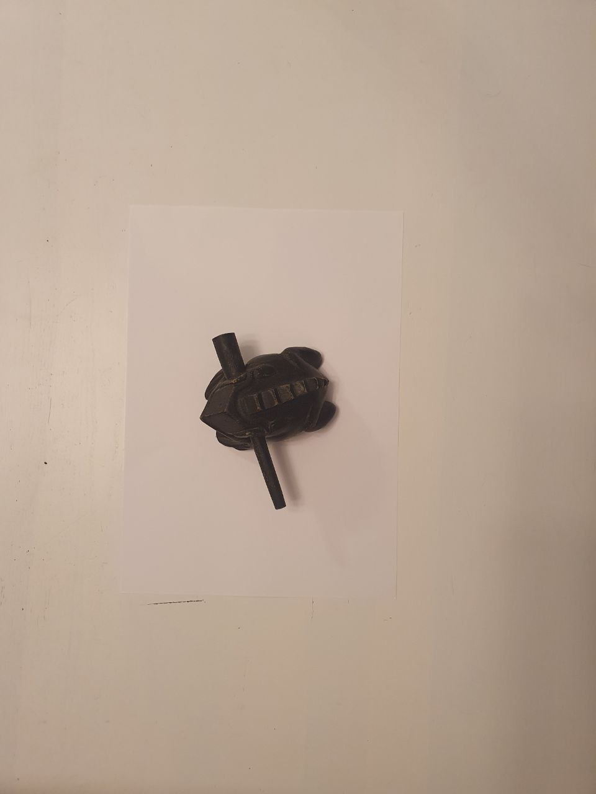
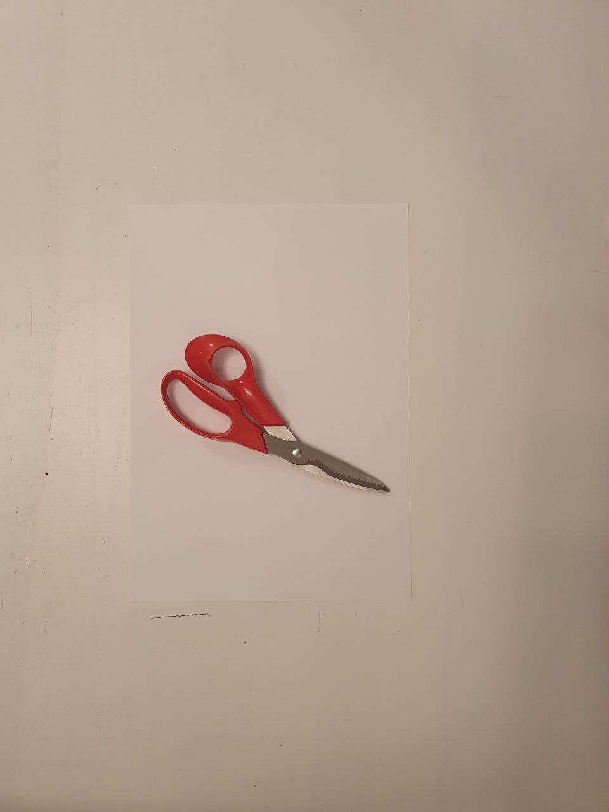
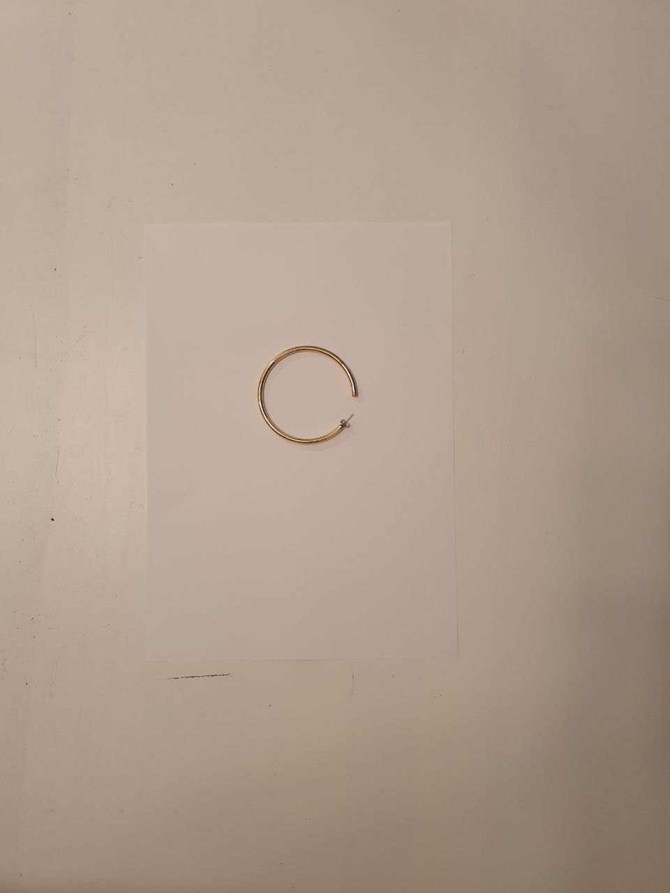
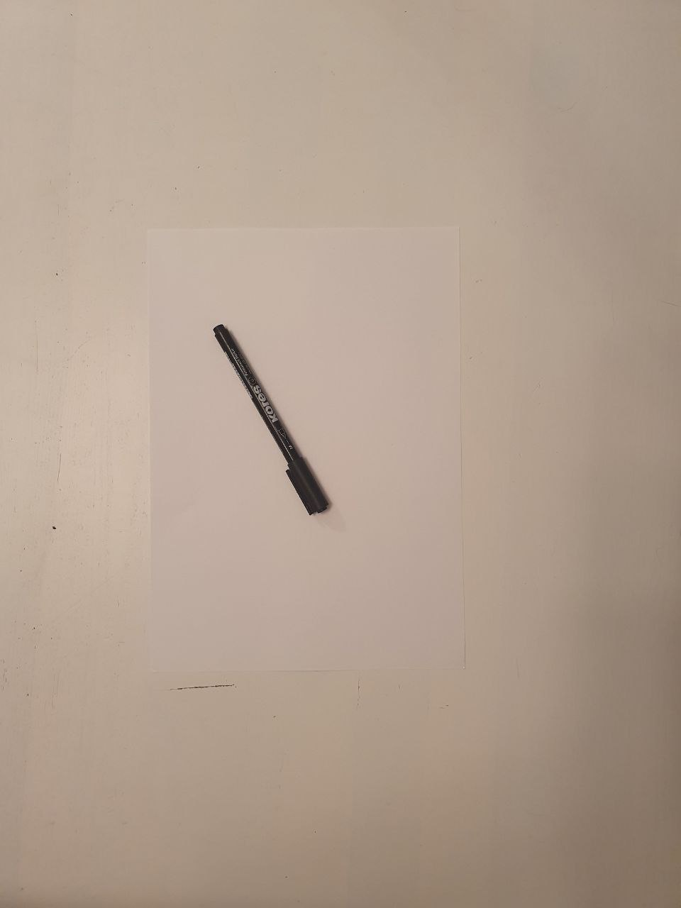
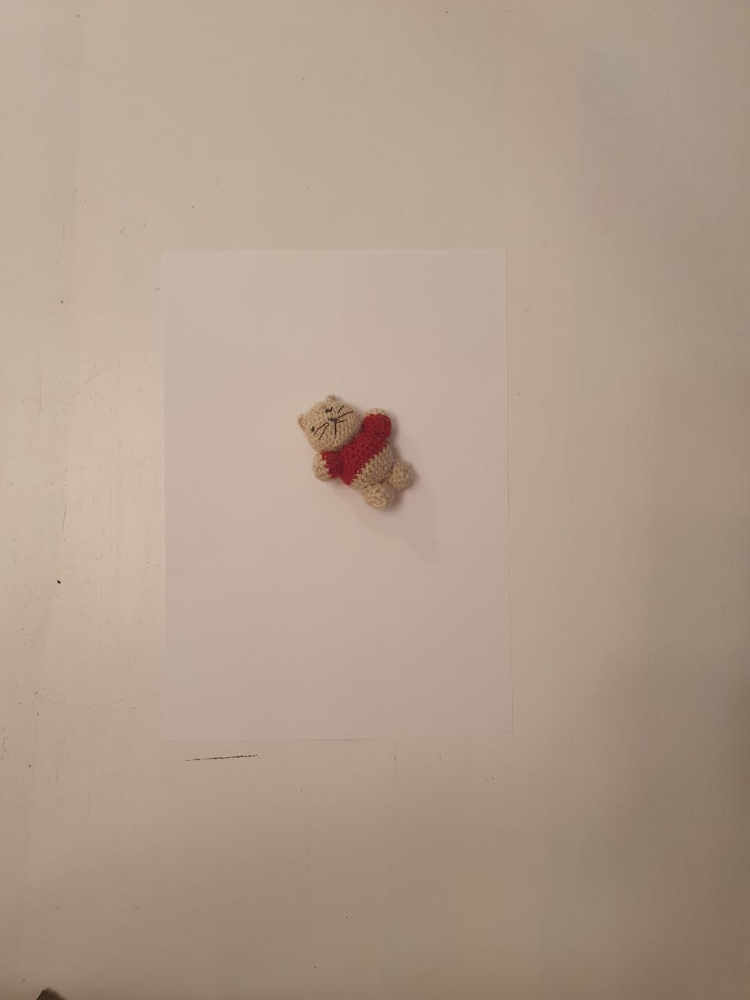
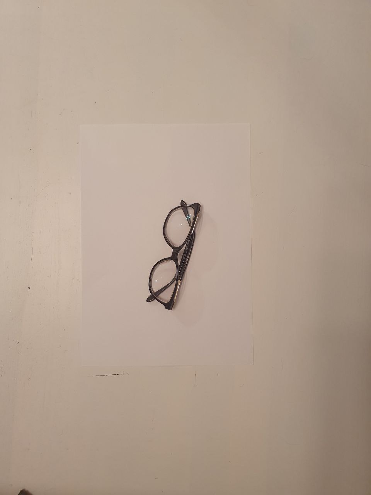
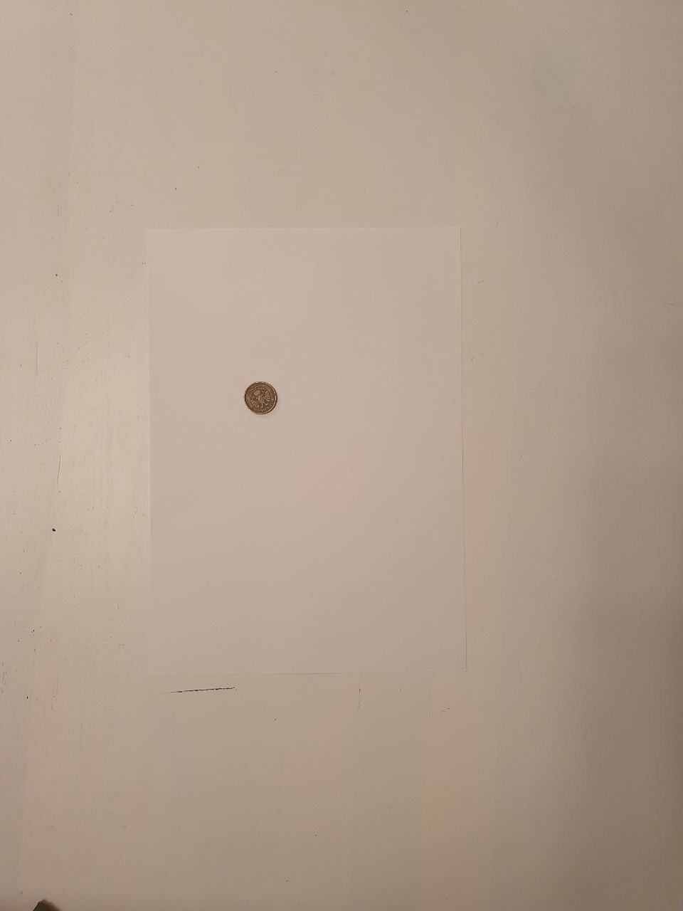
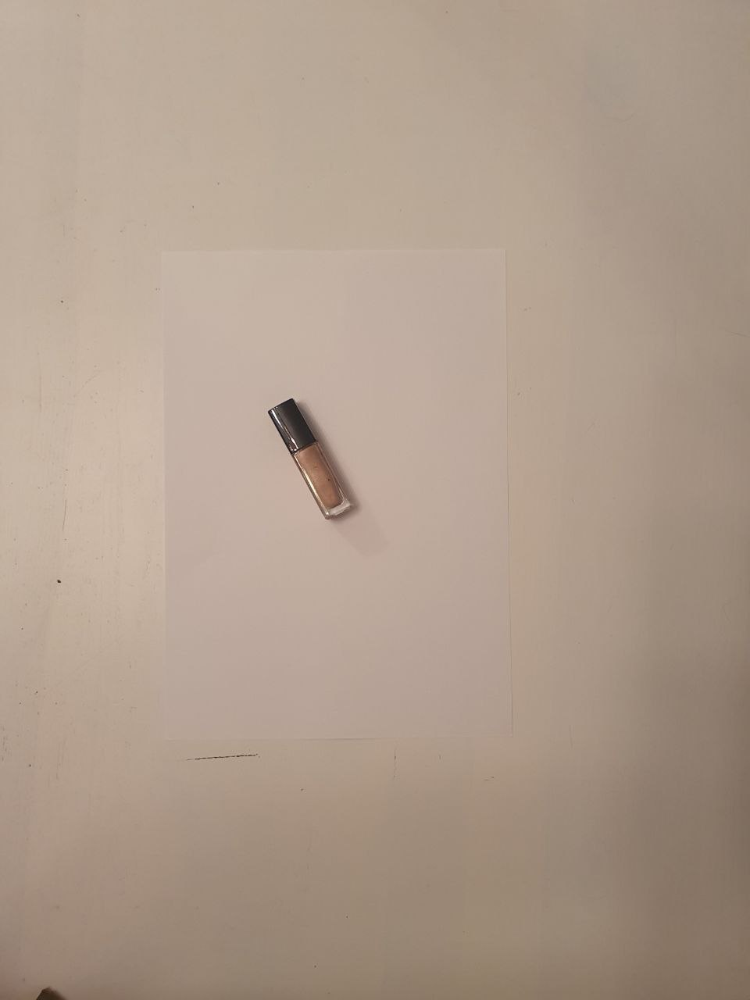
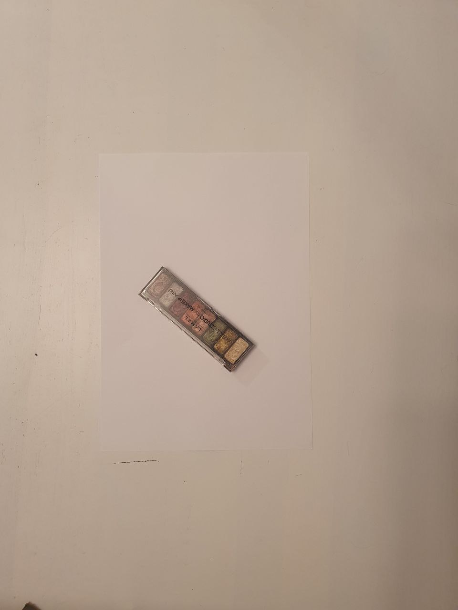

# intelligent-placer
## Требования
* Фигура
  * Фигура задается рисунком маркером на белом на листе формата А4.
  * Лист должен быть повернут горизонтально, стороны отклоняются не более чем на 5 градусов от границ кадра.
  * Предметы на фотографии не должны пересекаться с листом.
  * Фигура --- выпуклый многоугольник с не более чем 10-ю вершинами.
* Предметы
  * Предметы на фотографии не должны пересекаться друг с другом и с листом, на котором задана фигура.
  * Предметы не должны выходить за границы кадра.
  * Предметы должны находиться не менее чем в двух сантиметрах от границы кадра (измерения в естественной плоскости).
  * Предеметы на фотографии не могут повторятся.
* Фотография
  * Фотография делается на высоте от 40 до 60 сантиметров над поверхностью.
  * Фотография делается под углом от 85 до 95 градусов.
  * Освещение равномерное.
  * Фотография делается вертикально.
  * Формат .jpg.
  * Разрешение от 5 Мп.
 ## Предметы
1. Поверхность
 
2. 
3. 
4. 
5. 
6. 
7. 
8. 
9. 
10. 
11. 
