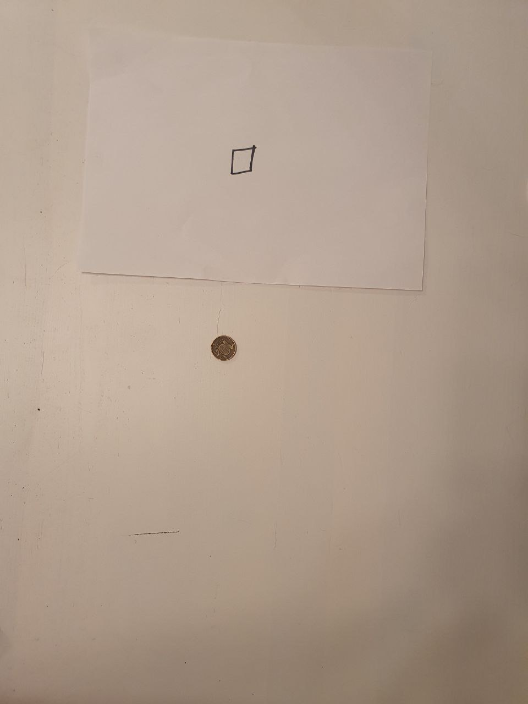
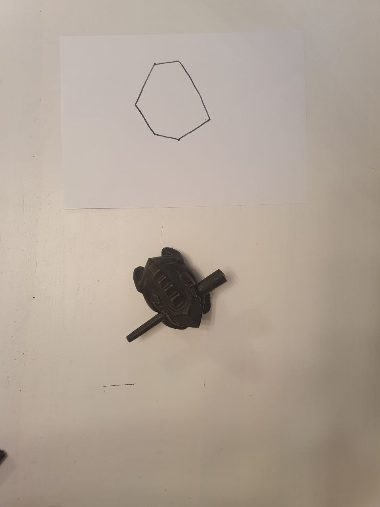
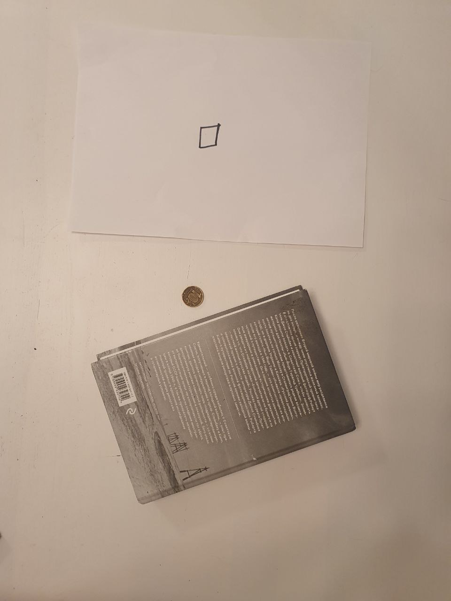

# Репрезентативные примеры

1. Не влезает даже самый маленький предмет (ответ нет) 
2. Жаба близкого размера, но все равно не влезает (ответ нет) 
3. Много предметов, которые сами по себе влезают. но  таком количестве нет (ответ нет)
4. Влезает даже самый большой предмет вместе с чем-то (ответ да) 
5. Все влезает с легкостью (ответ да) 
6. Предмет похожей формы с многоугольником, но не влезает (ответ нет) 
7. Много предметов, но все равно влезают (ответ да) 
8. Гарантированно не влезает (ответ нет) 
9. Надо как-то повращать, чтобы влезли (ответ да) 
10. Предеметы далеко, но влезают (ответ да) 
